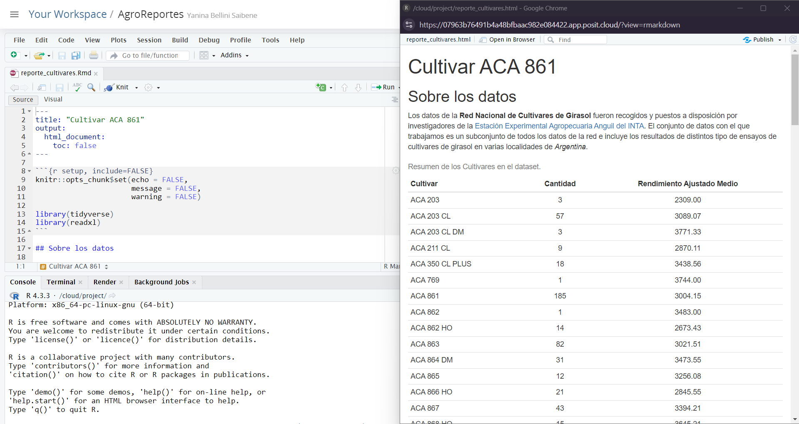

## ¿Por qué R?

Generamos reportes e informes para diversas actividades, a veces esos reportes son repetitivos en el tiempo (por ejemplo informes mensuales, informes al final de una campaña). Solemos utilizar más de un software para generarlos, seguramente alguna hoja de cálculo y algún procesador de texto. A veces sumamos algun aplicativo para hacer presentaciones. 

Si venís usándolos hace tiempo, seguro que aprendiste un montón de trucos para sacarle el jugo al máximo, habrás aprendido a usar fórmulas, tablas dinámicas, e incluso macros en las hojas de calculo y las plantillas y estilos en los documentos de texto o las presentaciones. Pero seguro que también sufriste sus limitaciones.

Por ejemplo, sn una hoja de cálculo no hay un límite claro entre datos y análisis. Sobrescribir datos es un peligro muy real y análisis complicados son imposibles de entender, especialmente si abrís una hoja de cálculo armada por otra persona (que quizás es tu vos del pasado). Además, repetir el análisis con datos distintos o cambiando algún parámetro se puede volver muy engorroso.

Seguro también tenes que copiar y pegar resultados o pasos intermedios de un software al otro, como un lindo gráfico de Excel al documento de Word con el informe.

Si lo que necesitás son reportes frecuentes y automáticos, y análisis de datos con muchas partes móviles, estaría bueno poder escribir una receta paso a paso y que la computadora corra todo automáticamente cada vez que se lo pedís. Para poder hacer eso, ese paso a paso tiene que estar escrito en un lenguaje que la computadora pueda entender, ese lenguaje es R.

## ¿Cómo vamos a trabajar?

Vamos a usar R como lenguaje de programación y RStudio como una IDE (Integrated Development Environment), un Entorno Integrado de Desarrollo. Si no los tenés instalado en tu computadora, no te preocupes, tenemos este  [proyecto en RStudio Cloud](https://posit.cloud/content/6431286) para que puedas trabajar.

Vamos a trabajar con archivos de RMarkdown para generar nuestro reportes y poder guardar el código que genera nuestro análisis, así que vamos a ver qué es un documento RMarkdown. Te preparamos [este informe de ejemplo](reporte_cultivares.Rmd), por favor abrilo en RStudio o en RStudio Cloud. 


## RMarkdown

Un archivo RMarkdown es un archivo de texto plano, con algunas reglas y una sintaxis especial que nos permite escribir código y texto juntos. Cuando se "teje" (knit), el código se evaluará y ejecutará y el texto se formateará de manera que se cree un informe o documento reproducible que sea agradable de leer y que contenga todo tu trabajo.

Esto es realmente crítico para la reproducibilidad. También nos ahorra tiempo y puede ayudar en las tareas de automatización. Este documento recreará tus figuras por ti en el mismo documento donde estás escribiendo el texto que las explica. Esto le ahorrará el esfuerzo de hacer un análisis, guardar un gráfico en un archivo, copiar y pegar ese gráfico en Word o Power Point o Google Slides, y tener que hacerlo todo de nuevo después de descubrir un error tipográfico.

Ahora veamos cómo es nuestro Informe de Cultivares.

* La parte superior tiene el Título y el tipo de salida (que en este caso es un documento HTML).
* Debajo hay secciones alternas _blancas_ y _grises_. Estas son las dos secciones principales que componen un archivo RMarkdown:
      * Las secciones grises son el código R
      * Las secciones blancas son el texto de Markdown
* Hay texto negro, azul y verde.

> Sigamos adelante y "tejamos (knit)" el documento haciendo clic en el ovillo de hilo azul () en la parte superior del archivo RMarkdown. 

¡Acabamos de crear un archivo html! Se trata de una única página web que estamos viendo localmente en nuestros propios ordenadores. Al generar este documento RMarkdown, R ha formateado el texto markdown y ha ejecutado el código R.



### Texto markdown

Podes ver una guia sobre rmarkdown [en esta guía rápida](https://raw.githubusercontent.com/rstudio/cheatsheets/main/translations/spanish/rmarkdown_es.pdf), pero aquí hay una sintaxis mínima para empezar:

* encabezados empiezan con `# ` o `## `y asi siguiendo (es importante poner un espacio después del último `#`).
* las palabras en negrita están rodeadas de `**`
* y las cursiva, con `_`

### Código de R

```{r include=FALSE}
chunk_start <- "```{r label}"
chunk_end <- "```"
```

El código R se escribe dentro de "chunks (trozos)" de código. Los trozos de código comienzan con `` `r chunk_start` `` (donde "label" es un nombre opcional y único) y terminan con `` `r chunk_end` ``. En RStudio, podes crear un nuevo chunk con el atajo de teclado `Ctrl + Alt + I`.

Este informe muestra información sobre un cultivar, pero podríamos cambiar algunas líneas de código para crear el mismo análisis para los otros cultivares incluidos en la base de datos.


> Ahora es tu turno. Sigue buscando en el código, si encuentras alguna mención a "ACA 861", cámbiala por cualquiera de los otros cultivares. 

Esta tarea es un poco engorrosa si hay que cambiar muchas cosas cada vez que queremos volver a ejecutar el análisis para diferentes especies. Pero no te preocupes, aprenderemos a hacer todo más automático al final del taller. 

